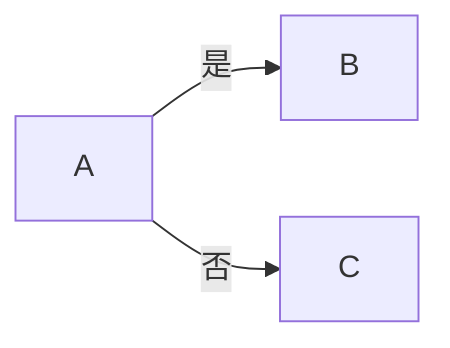
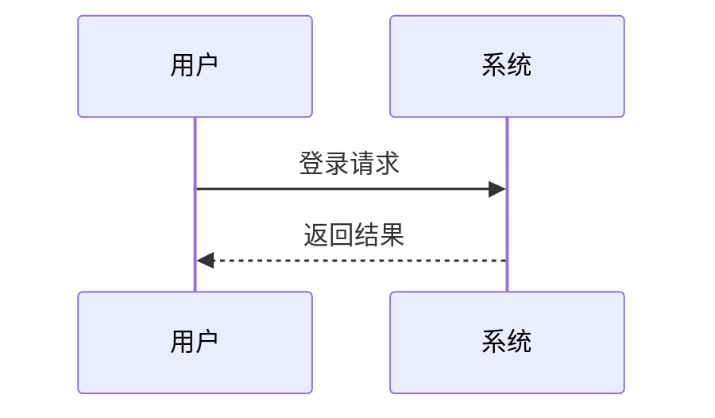
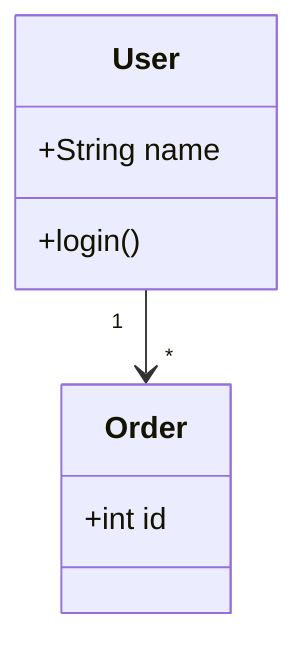
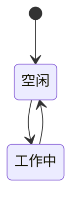
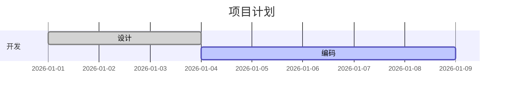
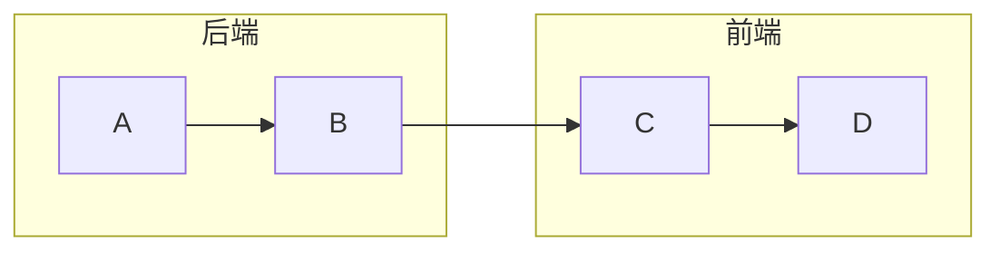
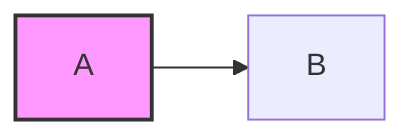
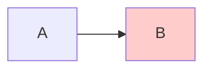
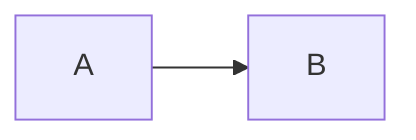

Mermaid 是一种**用文本描述图表**的语法，常用于 Markdown、文档、Wiki 和技术说明中。你只需要写“规则化的文字”，就能自动渲染成图。

下面我按**常用 → 进阶**的顺序，系统地介绍 Mermaid 的核心语法 👇

---

## 一、基本结构

所有 Mermaid 图表都遵循一个基本模式：

```mermaid
图表类型
    图表内容
```

例如：


---

## 二、流程图（Flowchart）——最常用 ⭐

### 1️⃣ 声明流程图方向

```mermaid
flowchart TD   %% 从上到下
flowchart LR   %% 从左到右
flowchart RL   %% 从右到左
flowchart BT   %% 从下到上
```

---

### 2️⃣ 节点写法


| 写法      | 形状     |
| ------- | ------ |
| `[ ]`   | 矩形     |
| `( )`   | 圆角矩形   |
| `(( ))` | 圆形     |
| `{ }`   | 菱形（判断） |

---

### 3️⃣ 连线方式

```mermaid
flowchart LR
    A --> B        %% 实线箭头
    B --- C        %% 实线无箭头
    C -.-> D       %% 虚线箭头
    D ==> E        %% 粗箭头
```

带文字的连线：



---

## 三、时序图（Sequence Diagram）

用于描述**对象/系统之间的交互顺序**。



常见箭头：

| 箭头     | 含义    |
| ------ | ----- |
| `->>`  | 同步请求  |
| `-->>` | 异步/返回 |
| `->`   | 普通消息  |
| `--`   | 虚线    |

---

## 四、类图（Class Diagram）

适合 **面向对象设计**。



关系符号：

| 符号    | 含义  |    |
| ----- | --- | -- |
| `<    | --` | 继承 |
| `*--` | 组合  |    |
| `o--` | 聚合  |    |
| `-->` | 关联  |    |

---

## 五、状态图（State Diagram）



---

## 六、甘特图（Gantt）

用于**项目进度计划**。



---

## 七、子图（Subgraph）



---

## 八、样式与高亮（进阶）

### 1️⃣ 定义样式



### 2️⃣ 类样式



---

## 九、注释



---

## 十、常见使用场景

* 📄 Markdown 文档（如 GitHub / GitLab）
* 📘 技术设计文档
* 🧠 系统架构图
* ⏱️ 时序 / 流程说明
* 📊 项目计划

---

## 十一、注意事项

* Mermaid 对**缩进不敏感**，但**符号非常敏感**
* 中文节点名完全支持
* 不同平台（Typora / GitHub / Notion）支持程度略有差异

