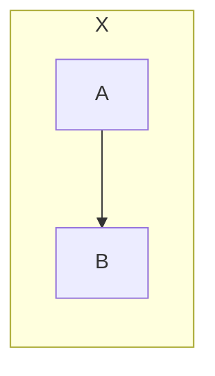

在 **Mermaid 流程图（flowchart / graph）**里，`TD` 和 `TB` **本质含义几乎一样，但“使用场景和兼容性”不同**。这正是你前面连续报错的根源之一。

我用一句话先给结论，然后展开解释。

---

## 一句话结论（先记住这个）

> **TD = Top → Down（简写）**
> **TB = Top → Bottom（标准写法）**

* **顶层 flowchart**：`TD`、`TB` 都可以
* **subgraph 内部**：**优先用 `TB`，更稳妥**
* **报错时**：把 `TD` 换成 `TB`，成功率极高 ✅

---

## 含义对照表

| 写法   | 全称         | 含义   | 是否推荐  |
| ---- | ---------- | ---- | ----- |
| `TD` | Top Down   | 从上到下 | 顶层 OK |
| `TB` | Top Bottom | 从上到下 | ✅ 通用  |
| `LR` | Left Right | 从左到右 | 通用    |
| `RL` | Right Left | 从右到左 | 通用    |
| `BT` | Bottom Top | 从下到上 | 通用    |

👉 **方向效果上：`TD ≈ TB`**

---

## 为什么会有 TD 和 TB 两种？

这是 **历史 + 兼容性**问题：

* 早期 Mermaid 用的是 `graph TD`
* 后来统一为 `direction TB / LR / RL / BT`
* 为了兼容老写法，**顶层**继续支持 `TD`
* 但 **subgraph 的 `direction` 语句是后来加的**，解析器期望的是 **完整方向枚举**（`TB/LR/...`）

结果就是：

> **TD 在 subgraph / 中途 direction 里，有些渲染器会直接炸**

---

## 正确 & 错误对比例子

### ✅ 顶层：TD / TB 都可以


---

### ❌ subgraph 内使用 TD（你之前的坑）



---

### ✅ subgraph 内正确写法


---

## 为什么报错信息看起来“完全不像方向错误”？

你看到的错误：

```
Expecting 'SEMI', 'NEWLINE', 'EOF', ...
got 'NODE_STRING'
```

这是因为：

* `direction TD` **没被识别成“方向语句”**
* 被当成了一个“普通节点字符串”
* 接下来一行出现 `G --> R`，语法树直接崩

👉 **Mermaid 的报错信息 = 词法层，非常不友好**

---

## 给你一个“永不翻车”的方向写法模板

### 顶层

```mermaid
flowchart TB
```

### subgraph

```mermaid
subgraph XXX
  direction TB
  ...
end
```

### 永远避免

```mermaid
direction TD   %% ❌ 非 subgraph
```

---

## 实战建议（结合你之前的错误）

你现在这张图，如果目标是：

* **整图从上到下**
* **局部 subgraph 也从上到下**

那就统一写：

```mermaid
flowchart TB
```

subgraph 里：

```mermaid
direction TB
```

**全部不要再用 TD**，你就几乎不会再遇到这种 parse error 了。

