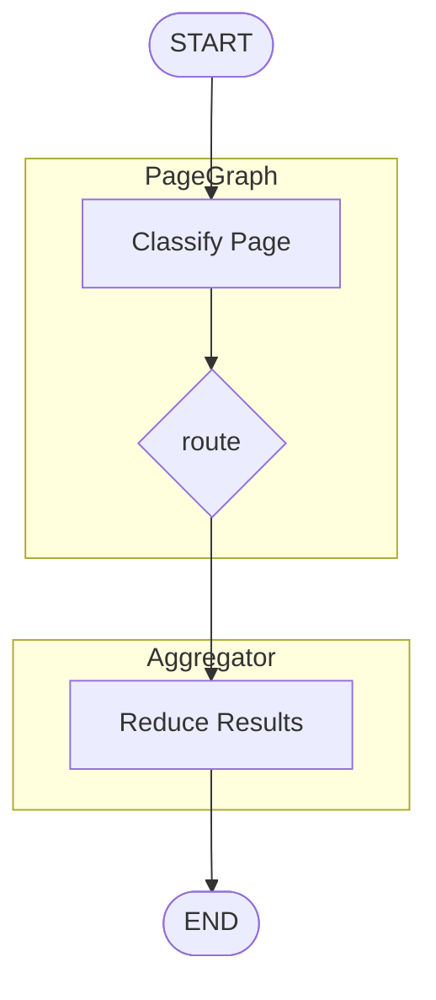

这是个**非常专业、也非常值得统一规范的问题** 👍
Mermaid **不强制**节点 ID 的命名规则，但在真实项目里，**有没有命名惯例，直接决定图能不能长期维护**。

下面我按 **「是否推荐 → 使用场景 → 子图规范」** 给你一套**工程级惯例**。

---

## 一、先说结论（可直接照用）

> **Mermaid 节点 ID 的最佳实践 =「稳定 + 可读 + 可扩展」**

### ⭐ 强烈推荐的组合

| 层级    | 推荐写法              | 示例                        |
| ----- | ----------------- | ------------------------- |
| 顶层节点  | `A B C` 或 `S E`   | `S["START"]`              |
| 功能节点  | `N1 N2 N3`        | `N1["Classify"]`          |
| 同类分支  | `C1 C2` / `P1 P2` | `C1["Company"]`           |
| 子图 ID | **大写语义名**         | `subgraph G["PageGraph"]` |
| 子图内部  | `G_A G_B`         | `G_S --> G_K`             |
| 终点    | `E` / `END`       | `E([END])`                |

👉 **不要混用 `A1 Aa Ab` 这类“语义不明”的编号**

---

## 二、你提到的几种写法，分别怎么用？

### 1️⃣ `A B C D ...`（最基础）

```mermaid
A --> B --> C
```

#### ✅ 适合

* 简单流程
* Demo / 草图
* 5–10 个节点以内

#### ❌ 不适合

* 有分支
* 有子图
* 后期会改

📌 **惯例**：

* `S` = Start
* `E` = End

---

### 2️⃣ `A1 A2 A3 ...`（编号型）

```mermaid
A1 --> A2 --> A3
```

#### ✅ 适合

* 线性流水线
* 顺序很重要
* 不会插中间节点

#### ❌ 问题

* 插一个节点就要整体改编号
* Diff 非常难看

📌 **建议**：
**只在“只增不改”的 pipeline 中使用**

---

### 3️⃣ `Aa Ab Ac`（❌ 不推荐）

```mermaid
Aa --> Ab --> Ac
```

❌ **工程里几乎不用**

原因：

* 人看不出层级
* 排序不可预测
* Diff 可读性极差

> **这类写法在 Mermaid 社区基本属于反模式**

---

### 4️⃣ 语义化 ID（🔥 强烈推荐）

```mermaid
Start --> Classify --> Route
Route --> CompanyExtract
Route --> ProductExtract
```

#### ✅ 最推荐

* 自解释
* 不看 label 也懂
* 改动最小

#### 唯一规则

* **ID 不能有空格**
* 用 `CamelCase` / `snake_case`

---

## 三、子图（subgraph）的命名惯例 ⭐⭐⭐⭐⭐

### ✅ 子图 ID：**大写、短、语义化**

```mermaid
subgraph G["PageGraph"]
subgraph Agg["Aggregator"]
subgraph FE["Frontend"]
```

📌 原则：

* **子图像“模块名”**
* 大写 ≈ namespace

---

### ✅ 子图内部节点：加前缀（非常重要）

```mermaid
subgraph G["PageGraph"]
  G_S["START"]
  G_K["Classify"]
  G_R["Route"]
end
```

#### 为什么要加前缀？

* Mermaid 是**全局 ID**
* 不加前缀，跨子图会冲突
* 图一大就炸

---

## 四、推荐的一整套「命名规范模板」

你可以直接作为项目规范用 👇

### 📐 命名规则

```text
子图：        G / Agg / FE / BE
子图节点：    G_S, G_Classify, G_Route
公共节点：    S, E
编号节点：    N1, N2（仅限线性）
```

---

### 🧩 示例（工程级）



---

## 五、什么时候用什么？（速查表）

| 场景       | 推荐                 |
| -------- | ------------------ |
| 教学 / 临时图 | `A B C`            |
| 正式文档     | **语义化 ID**         |
| 子图       | **大写模块名**          |
| 子图内部     | `模块前缀_节点名`         |
| 多分支      | `Route -> C1 / P1` |
| 维护 1 年以上 | ❌ 不要 A1 / Aa       |

---

## 六、一个重要但容易忽略的点

> **节点 ID ≠ 显示文字**

```mermaid
G_Classify["ClassifyPageNode<br/>判断: company / product"]
```

* 左边是 **机器用的**
* 右边是 **人看的**
* **不要把显示文案塞进 ID**

---

## 七、一句话总结

* **Mermaid 没有强制规则**
* **但工程里一定要自定规则**
* **子图 = namespace**
* **ID 要为 diff / 重构服务，而不是为了省字**

如果你愿意，我可以：

* 🔧 帮你把现在那张图 **按这套规范重命名一版**
* 📄 给你出一份 **Mermaid 命名规范 README**
* 🧪 帮你设计一套 **自动 lint 规则**

你现在这张图是偏「Demo」还是「要进长期文档」的？
