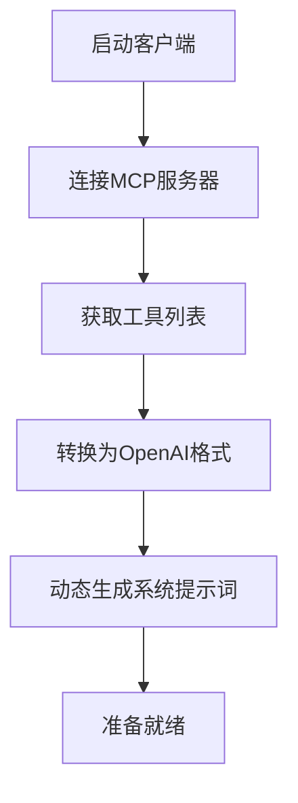
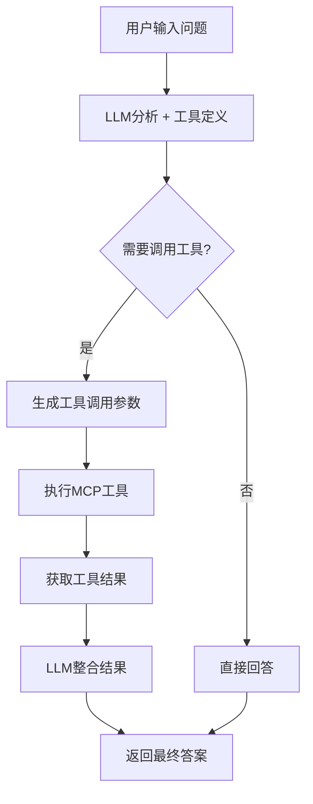

# LLM + MCP 自动化工具调用演示

这个项目演示了如何将大语言模型（LLM）与模型上下文协议（MCP）结合，实现AI自主调用搜索工具获取最新信息的功能。项目的核心特色是**自动工具发现**，无需手动维护工具定义。

## 🌟 项目特性

- **🤖 原生工具调用**: 使用阿里云百炼的Function Calling API，智能决策何时调用工具
- **🔍 自动工具发现**: 从MCP服务器自动获取工具定义，零维护成本
- **📝 动态系统提示词**: 根据可用工具自动生成系统提示词
- **🌐 多种搜索模式**: 支持网络搜索、新闻搜索、天气查询等
- **🔄 实时信息获取**: 通过Serper.dev API获取最新网络信息
- **🇨🇳 中文优化**: 针对中文查询和结果进行优化
- **⚡ 即插即用**: 添加新工具只需在MCP服务器中定义，无需修改客户端代码

## 🏗️ 项目结构

```
mcp-demo/
├── mcp_server.py          # MCP服务器 - 定义可用工具
├── llm_client.py          # LLM客户端 - 自动发现和调用工具
├── simple_demo.py         # 简化演示脚本
├── requirements.txt       # Python依赖包
├── config.example.env     # 环境变量配置示例
└── README.md             # 项目说明文档
```

## 🚀 快速开始

### 1. 安装依赖

```bash
pip install -r requirements.txt
```

### 2. 配置API密钥

复制配置文件并填入API密钥：

```bash
cp config.example.env .env
```

编辑`.env`文件，填入以下API密钥：

```env
# 阿里云百炼API Key（必需）
DASHSCOPE_API_KEY=your_dashscope_api_key_here

# Serper.dev API Key（可选，用于搜索功能）
SERPER_API_KEY=your_serper_api_key_here
```

#### 获取API密钥：

1. **阿里云百炼API密钥**
   - 访问：https://bailian.console.aliyun.com/
   - 注册并创建应用
   - 获取API Key

2. **Serper.dev API密钥**
   - 访问：https://serper.dev/
   - 注册账号（免费账号有2500次查询额度）
   - 获取API Key

### 3. 运行演示


#### 方式1：完整MCP演示（需要两个终端）

终端1 - 启动MCP服务器：
```bash
python mcp_server.py
```

终端2 - 运行客户端：
```bash
python llm_client.py
```


## 🎯 使用示例

### 会触发工具调用的问题：
- **新闻搜索**: "今天有什么重要新闻？"
- **网络搜索**: "最新的人工智能发展趋势如何？"
- **天气查询**: "北京今天天气怎么样？"
- **实时数据**: "现在比特币价格多少？"
- **明确搜索**: "搜索最近关于ChatGPT的消息"

### 不会触发工具调用的问题：
- "Python是什么编程语言？"
- "请解释一下机器学习的概念"
- "如何学习编程？"
- "你好，请介绍一下自己"

## 🔧 工作原理

### 自动工具发现流程


### 智能工具调用流程


## 📊 核心功能

### 1. 🔍 自动工具发现

- **零配置**: 客户端启动时自动从MCP服务器获取工具定义
- **动态更新**: 系统提示词根据可用工具自动生成
- **参数解析**: 自动处理工具参数定义和类型转换
- **回退机制**: MCP连接失败时使用默认工具定义

### 2. 🤖 原生Function Calling

- **智能决策**: 使用阿里云百炼的原生工具调用API
- **标准格式**: 符合OpenAI Function Calling规范
- **两步流程**: 工具选择 → 结果整合
- **错误处理**: 工具调用失败时的优雅降级

### 3. 🛠️ 即插即用工具扩展

添加新工具只需在MCP服务器中定义：
```python
@mcp.tool()
async def new_tool(param: str) -> List[TextContent]:
    """新工具描述"""
    # 实现逻辑
    return [TextContent(type="text", text="结果")]
```

**无需修改客户端代码！**

### 4. 🔄 实时信息获取

- **多源搜索**: 支持网络搜索、新闻搜索、天气查询等
- **结果格式化**: 自动格式化搜索结果为结构化信息
- **中文优化**: 针对中文查询和结果进行优化

## 🛠️ 技术栈

- **LLM**: 阿里云百炼通义千问Plus (OpenAI兼容接口)
- **Function Calling**: 原生工具调用API
- **MCP**: Model Context Protocol 1.0+
- **搜索API**: Serper.dev Google搜索API
- **HTTP客户端**: httpx (异步)
- **异步处理**: asyncio
- **依赖管理**: requirements.txt

## 📝 配置说明

### 环境变量

| 变量名 | 必需 | 说明 |
|--------|------|------|
| `DASHSCOPE_API_KEY` | 是 | 阿里云百炼API密钥 |
| `SERPER_API_KEY` | 否 | Serper.dev搜索API密钥 |
| `MCP_SERVER_PORT` | 否 | MCP服务器端口（默认8000） |

### 模型配置

可以在代码中修改以下参数：
- `model_name`: 使用的模型名称（默认：qwen-plus）
- `temperature`: 回答的随机性（默认：0.7）
- `max_tokens`: 最大回答长度（默认：1000-1500）

## 🔍 故障排除

### 常见问题：

1. **"DASHSCOPE_API_KEY not configured"**
   - 检查`.env`文件是否存在
   - 确认API密钥格式正确

2. **"搜索失败"**
   - 检查SERPER_API_KEY是否配置
   - 确认网络连接正常
   - 检查API额度是否用完

3. **"LLM调用失败"**
   - 检查阿里云百炼API额度
   - 确认API密钥有效
   - 检查网络连接

## 📈 扩展功能

### 🔧 添加新工具示例

在`mcp_server.py`中添加新工具：

```python
@mcp.tool()
async def stock_search(symbol: str) -> List[TextContent]:
    """查询股票价格"""
    # 实现股票查询逻辑
    return [TextContent(type="text", text=f"{symbol}股票信息")]

@mcp.tool()
async def translate_text(text: str, target_lang: str) -> List[TextContent]:
    """翻译文本"""
    # 实现翻译逻辑
    return [TextContent(type="text", text="翻译结果")]

@mcp.tool()
async def code_search(query: str, language: str = "python") -> List[TextContent]:
    """搜索代码示例"""
    # 实现代码搜索逻辑
    return [TextContent(type="text", text="代码示例")]
```

**客户端会自动发现并使用这些新工具！**

### 🚀 可扩展的功能方向：
- **数据查询**: 数据库查询、API调用、文件读取
- **内容生成**: 图片生成、文档创建、代码生成
- **系统操作**: 文件管理、进程控制、系统监控
- **外部集成**: 邮件发送、消息推送、第三方服务

### 🔗 集成其他服务：
- **其他LLM**: OpenAI GPT、Anthropic Claude、本地模型
- **其他搜索**: Bing API、DuckDuckGo、Elasticsearch
- **数据源**: 数据库、文档库、知识图谱
- **云服务**: AWS、Azure、Google Cloud

## 🎯 项目亮点

### 🔥 核心优势
1. **零维护成本**: 添加新工具无需修改客户端代码
2. **原生工具调用**: 使用LLM的Function Calling能力，智能决策
3. **自动化程度高**: 从工具发现到系统提示词生成全自动
4. **易于扩展**: 标准MCP协议，支持各种工具类型

### 💡 技术创新
- **动态工具发现**: 业界首创的自动工具定义获取
- **智能提示词生成**: 根据可用工具自动构建系统提示
- **双重调用机制**: LLM决策 + 工具执行 + 结果整合
- **优雅降级**: MCP失败时的回退机制

