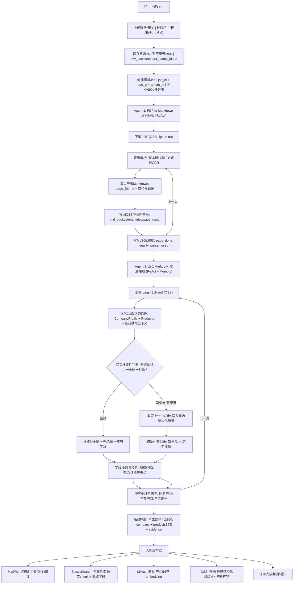
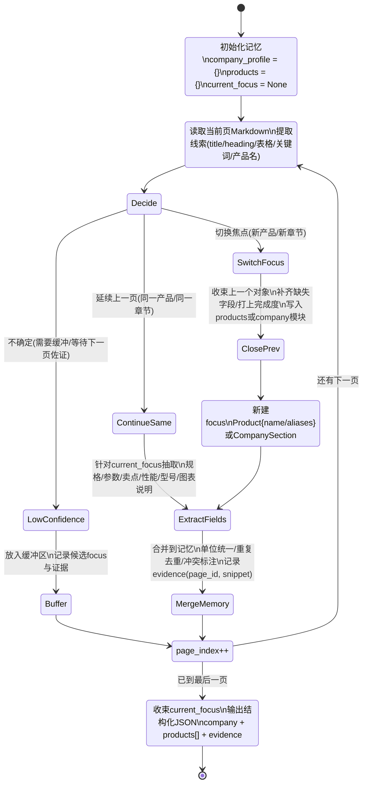
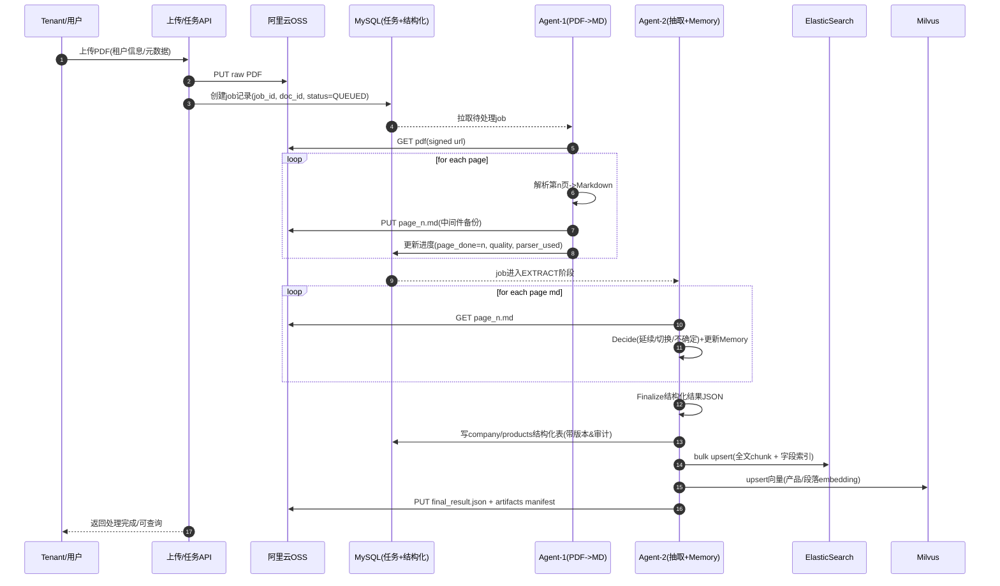

下面我按你描述的“两个 ReactAgent + 多存储入库”的思路，把**端到端工作流**和**跨页连续抽取（最难点）**用 mermaid 梳理出来：一张总流程图 + 一张“跨页产品抽取状态机/记忆更新”图 + 一张时序图。你拿去就能对齐研发拆任务。

---

---

## 2) 跨页“像人一样抽取产品信息”的核心：状态机 + 记忆更新（Mermaid）

这张图是你们 Agent-2 的核心逻辑：**每页读入 -> 判定延续/切换 -> 更新记忆 -> 收束/落盘**。

**你提到的难点（第3页识别到产品A，第4页继续产品A，同时判断是否出现别的产品）**，在这个状态机里对应的是 `Decide` 的三分支：

* `ContinueSame`：检测到“上页焦点仍然成立”（标题延续、表格未完、同型号/同产品名、‘续表/continued’、参数表紧接等）
* `SwitchFocus`：检测到“明显新产品/新章节”（新产品名/型号集合变化、新一级标题、目录结构跳转等）
* `LowConfidence`：模糊页（只有一些参数但没标题），先缓冲，等下一页标题或更多证据再回填

---

## 3) 端到端时序图（两段Agent + 四库入库）

---

## 4) 你们的库怎么分工（建议的“最顺手”落点）

* **OSS**

  * raw PDF（原始）
  * 中间件：逐页 markdown + 解析元数据（比如 page_id、bbox、表格结构）
  * final_result.json（最终抽取结果归档）
* **MySQL（权威结构化事实库）**

  * job/状态机/幂等（job_id、版本、重试次数、失败原因）
  * company/profile（公司简介、资质、规模、优势）
  * product（产品主表 + 参数表 + 规格表 + 卖点表）
  * evidence（字段证据：page_n + snippet + offset）
* **ElasticSearch（检索与运营侧查询）**

  * doc/page/chunk 维度的全文检索
  * 把抽取字段也写进去，支持“按字段过滤 + 关键词搜索”
* **Milvus（语义召回）**

  * chunk 向量（段落级）
  * product card 向量（产品级摘要向量）
  * 支持“相似产品/问答式检索/语义搜索”

---

## 5) 我给你一个“Decide 跨页延续/切换”的判定清单（直接变成规则+提示词）

在 Agent-2 的 `Decide` 节点里，你们可以把信号分成三类（越靠前越强）：

**强信号：切换到新焦点**

* 出现新一级标题（如 `# 产品B`、`2.2 产品B`）
* 出现明显新产品名/新型号集合（且与 current_focus 差异大）
* 页眉/目录标识显示章节变化（如“产品介绍”->“资质认证”）

**强信号：延续同一焦点**

* 标题延续/重复（同产品名、同型号）
* 表格续表（“续表/continued/表X（续）”）
* 同一参数表在上一页未结束（上一页末尾是表格/冒号未完句/“……”）

**弱信号：不确定 -> Buffer**

* 只有参数、单位、数值，但缺少产品名/标题
* 图片说明/图注较多，正文少
* 扫描件OCR置信度低，结构不清晰

Buffer 的意义：先别做“错误切换”，宁可延迟一页再决定，然后回填。

---

如果你愿意，我还能继续把它压成一份**可直接落地的 Agent-2 Memory 结构（JSON schema）+ 入库表结构映射 + ES index mapping** 的 mermaid/草案（不问你任何额外问题，我会按通用企业产品手册的字段设计直接给一版）。
