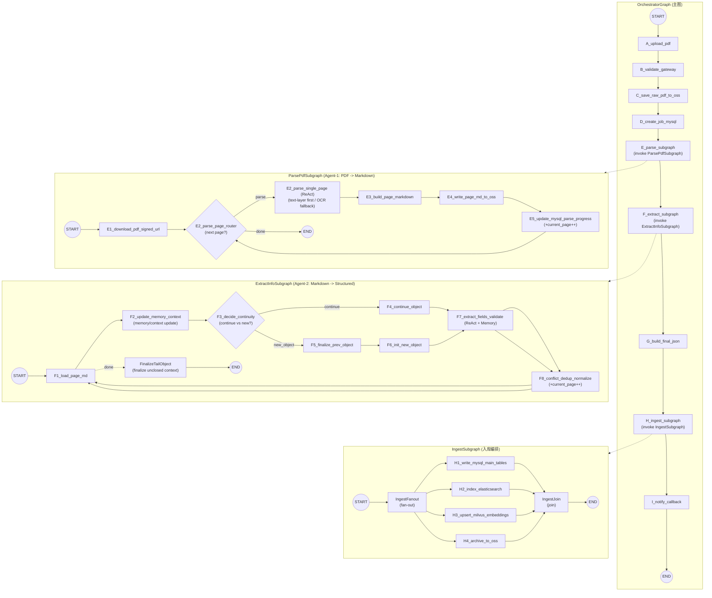

```mermaid
flowchart TD
  %% =========================
  %% Main Orchestrator Graph
  %% =========================
  subgraph OrchestratorGraph["OrchestratorGraph (主图)"]
    START((START))
    A_upload_pdf["A_upload_pdf"]
    B_validate_gateway["B_validate_gateway"]
    C_save_raw_pdf_to_oss["C_save_raw_pdf_to_oss"]
    D_create_job_mysql["D_create_job_mysql"]

    E_parse_subgraph["E_parse_subgraph\n(invoke ParsePdfSubgraph)"]
    F_extract_subgraph["F_extract_subgraph\n(invoke ExtractInfoSubgraph)"]
    G_build_final_json["G_build_final_json"]
    H_ingest_subgraph["H_ingest_subgraph\n(invoke IngestSubgraph)"]
    I_notify_callback["I_notify_callback"]
    END((END))

    START --> A_upload_pdf --> B_validate_gateway --> C_save_raw_pdf_to_oss --> D_create_job_mysql
    D_create_job_mysql --> E_parse_subgraph --> F_extract_subgraph --> G_build_final_json --> H_ingest_subgraph --> I_notify_callback --> END
  end

  %% =========================
  %% Subgraph 1: Parse PDF -> Markdown (Agent-1)
  %% =========================
  subgraph ParsePdfSubgraph["ParsePdfSubgraph (Agent-1: PDF -> Markdown)"]
    P_START((START))
    E1_download_pdf_signed_url["E1_download_pdf_signed_url"]
    E2_parse_page_router{"E2_parse_page_router\n(next page?)"}
    E2_parse_single_page["E2_parse_single_page (ReAct)\n(text-layer first / OCR fallback)"]
    E3_build_page_markdown["E3_build_page_markdown"]
    E4_write_page_md_to_oss["E4_write_page_md_to_oss"]
    E5_update_mysql_parse_progress["E5_update_mysql_parse_progress\n(+current_page++)"]
    P_END((END))

    P_START --> E1_download_pdf_signed_url --> E2_parse_page_router
    E2_parse_page_router -->|parse| E2_parse_single_page --> E3_build_page_markdown --> E4_write_page_md_to_oss --> E5_update_mysql_parse_progress --> E2_parse_page_router
    E2_parse_page_router -->|done| P_END
  end

  %% =========================
  %% Subgraph 2: Extract info per page (Agent-2)
  %% =========================
  subgraph ExtractInfoSubgraph["ExtractInfoSubgraph (Agent-2: Markdown -> Structured)"]
    X_START((START))
    F1_load_page_md["F1_load_page_md"]
    F2_update_memory_context["F2_update_memory_context\n(memory/context update)"]
    F3_decide_continuity{"F3_decide_continuity\n(continue vs new?)"}

    F4_continue_object["F4_continue_object"]
    F5_finalize_prev_object["F5_finalize_prev_object"]
    F6_init_new_object["F6_init_new_object"]

    F7_extract_fields_validate["F7_extract_fields_validate (ReAct + Memory)"]
    F8_conflict_dedup_normalize["F8_conflict_dedup_normalize\n(+current_page++)"]

    FinalizeTailObject["FinalizeTailObject\n(finalize unclosed context)"]
    X_END((END))

    X_START --> F1_load_page_md --> F2_update_memory_context --> F3_decide_continuity

    F3_decide_continuity -->|continue| F4_continue_object --> F7_extract_fields_validate --> F8_conflict_dedup_normalize --> F1_load_page_md
    F3_decide_continuity -->|new_object| F5_finalize_prev_object --> F6_init_new_object --> F7_extract_fields_validate --> F8_conflict_dedup_normalize --> F1_load_page_md

    %% done condition (implicit when current_page > page_count)
    F1_load_page_md -.->|done| FinalizeTailObject --> X_END
  end

  %% =========================
  %% Subgraph 3: Ingest to storages
  %% =========================
  subgraph IngestSubgraph["IngestSubgraph (入库编排)"]
    I_START((START))
    IngestFanout["IngestFanout\n(fan-out)"]

    H1_write_mysql_main_tables["H1_write_mysql_main_tables"]
    H2_index_elasticsearch["H2_index_elasticsearch"]
    H3_upsert_milvus_embeddings["H3_upsert_milvus_embeddings"]
    H4_archive_to_oss["H4_archive_to_oss"]

    IngestJoin["IngestJoin\n(join)"]
    I_END((END))

    I_START --> IngestFanout
    IngestFanout --> H1_write_mysql_main_tables --> IngestJoin
    IngestFanout --> H2_index_elasticsearch --> IngestJoin
    IngestFanout --> H3_upsert_milvus_embeddings --> IngestJoin
    IngestFanout --> H4_archive_to_oss --> IngestJoin
    IngestJoin --> I_END
  end

  %% =========================
  %% Invocation links (conceptual)
  %% =========================
  E_parse_subgraph -.-> ParsePdfSubgraph
  F_extract_subgraph -.-> ExtractInfoSubgraph
  H_ingest_subgraph -.-> IngestSubgraph
```
