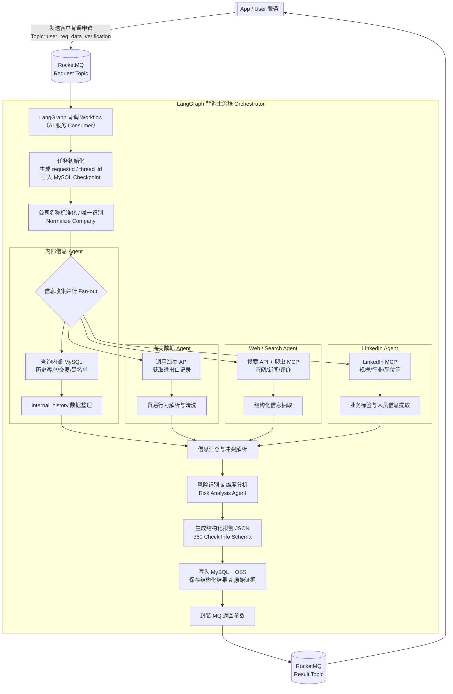

## 工作流分析

### 🧩 整体流程结构图（建议版）



📎 该流程紧密契合你文档中的接口 1 & 2 逻辑
并保持了 LangGraph 的状态式调度与可恢复性


---

### 📊 节点逻辑再解释一下（便于团队 Review）

#### 🟦 1. Orchestrator 主流程

负责：

✔ 编排
✔ State 管理
✔ Checkpoint 恢复
✔ 错误兜底

并且：

* 每个任务绑定

  ```
  thread_id = requestId
  ```
* 所有中间状态 state 存 MySQL

---

#### 🟩 2. 信息收集 = 并行子 Agent

| Agent          | 来源      | 作用          |
| -------------- | ------- | ----------- |
| Internal Agent | MySQL   | 历史业务关系、黑名单  |
| Customs Agent  | 海关 API  | 判断真实贸易行为    |
| Web Agent      | 搜索 + 爬虫 | 获取公开信息      |
| LinkedIn Agent | MCP     | 组织规模 & 人员结构 |

LangGraph 直接 `fan-out`
提升响应速度 🚀

---

#### 🟨 3. 风险识别 Agent

输出：

* 风险等级
* 各维度评分
* 证据来源说明
* 结构化 JSON

与接口 2 中字段一一对应 ✔

---

#### 🟥 4. MQ 通道

| Topic                      | 方向 | 内容   |
| -------------------------- | -- | ---- |
| user_req_data_verification | 入站 | 背调请求 |
| ai_resp_data_verification  | 出站 | 背调结果 |

完全与你文档保持一致
便于直接集成

