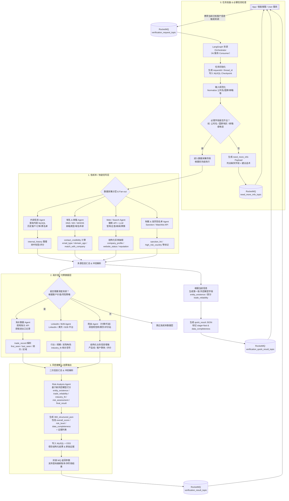

```mermaid
flowchart TD

A[[App / 智能客服 / User 服务]] -- 携带当前已知客户信息<br/>触发背调 --> MQ1[(RocketMQ<br/>verification_request_topic)]

MQ1 --> B[LangGraph 背调 Orchestrator<br/>（AI 服务 Consumer）]

%% ================= 0. 准备 & 信息优先级层 =================
subgraph G0[0. 任务准备 & 必要信息检查]
    B --> C[任务初始化<br/>生成 requestId / thread_id<br/>写入 MySQL Checkpoint]

    C --> C1[输入规范化<br/>Normalize 公司名/国家/邮箱等]

    C1 --> C2{必需字段是否齐全？<br/>如: 公司名 / 国家地区 / 邮箱或电话}

    C2 -- 否 --> R1[生成 need_more_info Payload<br/>列出缺失字段 + 建议话术]
    R1 --> MQ_NEED[(RocketMQ<br/>need_more_info_topic)]
    MQ_NEED --> A

    C2 -- 是 --> D[进入数据采集阶段<br/>根据优先级执行]
end

%% ================= 1. 低成本快速信号层 =================
D --> E{数据采集分层 & Fan-out}

subgraph G1[1. 低成本 / 快速信号层]
    direction LR
    E --> F1[内部信息 Agent<br/>查询内部 MySQL<br/>历史客户/订单/黑名单]
    F1 --> M1[internal_history 整理<br/>命中标签/评分]

    E --> F2[域名 & 邮箱 Agent<br/>DNS / MX / WHOIS<br/>邮箱类型/域名年龄]
    F2 --> M2[contact_credibility 计算<br/>email_type / domain_age / match_with_company]

    E --> F3[Web / Search Agent<br/>搜索 API + LLM<br/>官网/企查/新闻/舆情]
    F3 --> M3[结构化实体抽取<br/>company_profile / website_status / reputation]

    E --> F4[制裁 & 高风险名单 Agent<br/>Sanction / Watchlist API]
    F4 --> M4[sanction_hit / high_risk_country 等标记]
end

M1 --> H[多源信息汇总 & 冲突解析]
M2 --> H
M3 --> H
M4 --> H

%% 快速版结果（可选）
H --> I1[根据当前信息<br/>生成第一版 风控模型字段<br/>entity_existence / 部分 trade_reliability]
I1 --> J1[生成 quick_result JSON<br/>标记 stage=fast & data_completeness]

J1 --> MQ_QUICK[(RocketMQ<br/>verification_quick_result_topic)]
MQ_QUICK --> A

%% ================= 2. 高价值 / 付费数据层 =================
H --> E2{是否需要深度背调？<br/>根据客户价值/风险策略}

E2 -- 否 --> I2[跳过高成本数据层]

E2 -- 是 --> G2

subgraph G2[2. 高价值 / 付费数据层]
    direction LR
    E2 --> F5[海关数据 Agent<br/>调用海关 API<br/>获取进出口记录]
    F5 --> M5[trade_record 解析<br/>first_seen / last_seen / 频次 / 区域]

    E2 --> F6[LinkedIn / B2B Agent<br/>LinkedIn / 黄页 / B2B 平台]
    F6 --> M6[行业 / 规模 / 采购角色<br/>industry_fit 相关信号]

    E2 --> F7[爬虫 Agent （付费/可选）<br/>深度爬官网/黄页/评价站]
    F7 --> M7[结构化业务信息增强<br/>产品线 / 客户群体 / 评价]
end

M5 --> H2[二次信息汇总 & 冲突解析]
M6 --> H2
M7 --> H2

%% ================= 3. 新风控模型打分 & 持久化 =================
subgraph G3[3. 风控建模 & 结果输出]
    H2 --> I[Risk Analysis Agent<br/>基于新风控模型打分<br/>entity_existence / trade_reliability / industry_fit / risk_assessment / final_result]

    I --> J[生成 360_structured_json<br/>包括 overall_score / risk_level / data_completeness<br/>+ 证据列表]

    J --> K[写入 MySQL + OSS<br/>保存结构化结果 & 原始证据]

    K --> L[封装 MQ 返回参数<br/>支持查询最新版本/多阶段结果]
end

L --> MQ2[(RocketMQ<br/>verification_result_topic)]
MQ2 --> A

```