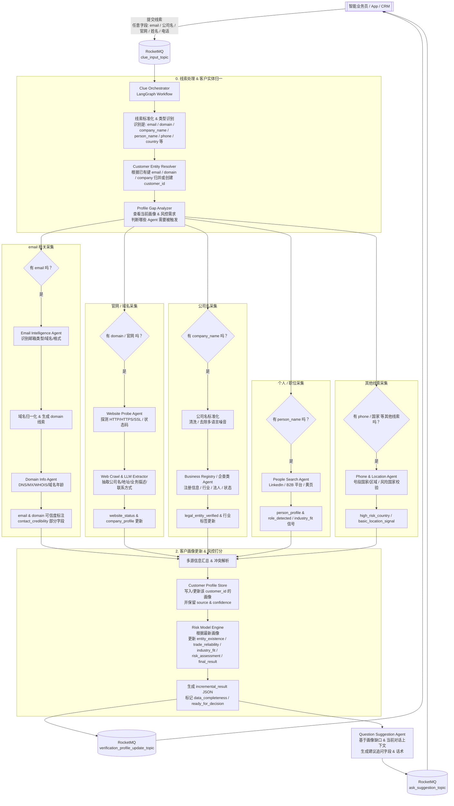

好，理解你的新诉求就是四个字：**“见缝插针”**。
——只要有一点点线索，就立刻开查、立刻反馈，和智能业务员形成一个持续闭环。

我帮你把工作流改成「**线索驱动 / 增量背调**」模型。

---

## 一、设计原则先说清楚

1. **不再等“必填信息齐全”才启动背调**

   * 只要有任意一个字段：`email / 公司名 / 官网 / 业务员姓名 / 电话 / 国家`
   * 就启动对应的采集 Agent（或多个 Agent）

2. **所有采集结果都是增量的**

   * 每次只基于当前已知线索补一块信息
   * 所有信息都统一写入一个「客户实体画像」里（Customer Profile）

3. **每条信息都要打三个标签**

   * `value`：信息本身
   * `source`：来源（海关 / 搜索 / 内部历史 / 客户自己说的）
   * `confidence`：可信度（0~1）+ `source_reliability`

4. **必要信息由“画像缺口分析器”决定，而不是写死**

   * 风控模型说“要做决策至少需要 X、Y、Z”
   * 如果缺，就生成「建议提问」给智能业务员

5. **智能业务员和背调系统是一个不断迭代的循环**

   * 客户说一句话 → 产生新线索 → 触发新一轮采集 → 更新风险画像 → 再决定要不要问新问题

---

## 二、新工作流（线索驱动 / 增量背调版）

### Mermaid 工作流 v3



---

## 三、关键改动点逐条解释（对比你之前的设计）

### 1. 启动条件从「背调申请」变成「线索输入」

**旧：**

* App / 智能客服需要明确发一个「客户背调申请」

**新：**

* 任何一条线索都可以触发：

  * 客户发来邮箱 → 立刻跑 `Email + Domain` 相关 Agent
  * 客户发来官网 → 立刻跑 `Website + Crawl`
  * 业务员手动录入公司名 → 立刻跑 `Business Registry`
  * 客户提到 “I’m purchasing manager” → 立刻触发 `People / industry_fit`

> 背调工作变成“持续监听事件”的后台服务，而不是一次性任务。

---

### 2. 不再「一刀切必填字段检查」，改成「画像缺口 + 决策需求」

以前是：**没公司名/没国家就不跑**
现在是：

* 对风控模型定义：

  * 做“初步跟进”需要哪些字段？
  * 做“放货/授信”需要哪些字段？

* `Profile Gap Analyzer` 的能力：

  * 对于当前阶段（例如：只是线索甄别），允许很多字段缺失
  * 对于需要“决策”的节点（比如放额度），才要求必须有：

    * `company_name`
    * `country`
    * 一定程度的 `entity_existence_score` + `trade_reliability_score`

缺什么，就在 `Question Suggestion Agent` 里生成**有理由的追问**。
但即使当前不齐，也照样可以更新画像、提升可信度。

---

### 3. 每次返回的是「增量结果」，而不是只有一次最终报告

你现在可以让系统这样工作：

* 第一次：只有 email

  * 结果：

    * `contact_credibility` 有一部分（邮箱类型/域名年龄）
    * `entity_existence` 只有弱信号
    * `data_completeness = 0.2`

* 第二次：客户补了官网

  * 新触发 website + crawl + company name 抽取
  * 结果：

    * `website_status` 变丰富
    * 抽出公司名 + 地址，提升 `entity_existence_score`
    * `data_completeness = 0.4`

* 第三次：你们从内部黑名单里查到记录

  * 更新 `trade_reliability` / `risk_assessment`
  * `overall_score` 大幅变化
  * `data_completeness = 0.6`

每次更新都会发一条 `verification_profile_update_topic` 给智能业务员：

> “当前客户可信度 0.76，数据完整度 0.4，建议正常跟进但后续要关注付款方式。”

---

### 4. 对智能业务员来说：三个输入、两个输出

**智能业务员输入：**

1. `clue_input_topic`：任何从客户那儿拿到的新字段，都可以异步扔进来
2. `verification_profile_update_topic`：实时获取最新的风控画像和建议
3. `ask_suggestion_topic`：需要补充的关键字段 + 推荐话术

**智能业务员输出：**

1. 继续向客户询问自然问题（让客户觉得是为推荐方案 / 报价，而不是审查）
2. 把客户回答过来的新线索再回灌到 `clue_input_topic`（形成闭环）

---

## 四、建议的数据结构示例（返回给智能业务员）

### 1）增量结果 incremental_result（供业务员用）

```json
{
  "customer_id": "cust_123",
  "entity_existence": {
    "existence_score": 0.76,
    "signals": [
      {
        "type": "website",
        "value": "https://abc-trading.com",
        "confidence": 0.9,
        "source": "web_crawl"
      },
      {
        "type": "business_registry",
        "value": "ABC TRADING LTD",
        "confidence": 0.95,
        "source": "registry_api"
      }
    ]
  },
  "trade_reliability": {
    "trade_score": 0.4,
    "import_export_record": {
      "has_record": false,
      "confidence": 0.7
    }
  },
  "industry_fit": {
    "industry_detected": "unknown",
    "confidence": 0.2
  },
  "risk_assessment": {
    "risk_level": "medium",
    "flags": ["free_email_domain"],
    "recommendation": "normal_followup"
  },
  "final_result": {
    "overall_score": 0.6,
    "data_completeness": 0.35,
    "ready_for_decision": false,
    "stage": "incremental"
  },
  "updated_fields": ["entity_existence", "contact_credibility", "risk_assessment"],
  "updated_at": "2026-01-07T10:20:00Z"
}
```

### 2）建议追问 ask_suggestion（指导智能业务员问什么）

```json
{
  "customer_id": "cust_123",
  "missing_key_fields": [
    {
      "field": "company_name",
      "reason": "缺少公司名称，无法在注册库和海关数据中精确查询",
      "priority": "high",
      "suggested_prompt": "为了给您出正式报价单，方便提供一下贵司的英文全称吗？"
    },
    {
      "field": "industry",
      "reason": "需要了解您主要服务的行业，以推荐合适产品线",
      "priority": "medium",
      "suggested_prompt": "您目前主要服务的是哪个行业的客户呢？例如建材、电商、零售门店这类。"
    }
  ],
  "next_check_time_sec": 0
}
```

---

## 五、这版的几个优势（你可以拿去讲给技术 & 商业团队）

1. **对话体验：**

   * 客户说的每一句话都有价值，不会“白说”
   * 业务员不需要一次性问完所有问题

2. **系统灵活性：**

   * 任意线索都可以从任意入口触发（IM、表单、人工录入）
   * 不同 Agent 可以独立扩展 / A/B 测试

3. **风控质量：**

   * 模型对“信息缺失”有显式认知（`data_completeness`）
   * 不会用残缺信息给出过度自信的判断

4. **工程落地：**

   * 仍然是 MQ + LangGraph 架构，只是从“单次任务”升级成“事件流 + 画像存储”
   * 每个 Agent 都是松耦合，可按数据成本分层启用

---

如果你接下来想落地到 PRD / 设计文档，我可以帮你继续细化：

* 各 Agent 的输入/输出 JSON Schema
* Customer Profile Store 的表结构设计（images + evidence）
* 对话侧 / 背调侧 MQ Topic 协议
* 风控策略配置（哪些场景需要 `ready_for_decision=true` 才允许放货）

你直接跟我说：“帮我写一下 Agent I/O 和表结构”，我就往下拆 👌
