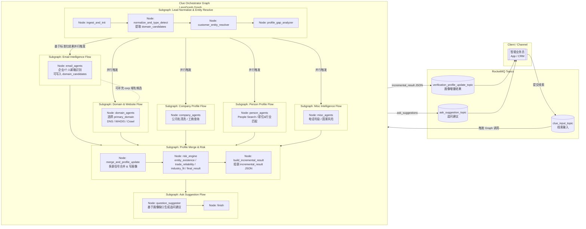
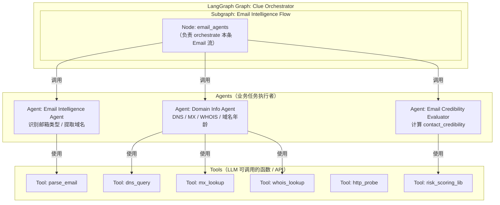

## Mermaid
### 1️⃣ 总体分层架构图（从业务入口到 Tool）

> 这一张图上：
>
> * **G = LangGraph Graph**（Clue Orchestrator）
> * `SG_* = Subgraph`
> * `N*_* = Node`
> * MQ 只是 I/O，不属于 Graph

---

### 2️⃣ Graph 内部：Node → Agent → Tool 关系

下面这张是“概念架构图”，专门说明 Node、Agent、Tool 的关系（以 Email 分支为例，其他类似）。

可以直接照这个 pattern 把其他分支扩展：

* `domain_agents` Node → Website Probe Agent / Web Crawl Agent / Website Profile Merger → http_probe / crawl_html / extract_text / llm_extract_profile
* `company_agents` Node → Company Name Cleaner / Business Registry Agent → query_business_db …
* `person_agents` Node → People Search Agent → linkedin_search / company_employee_lookup …
* `misc_agents` Node → Phone & Location Agent → phone_geo_lookup / risk_country_db
* `risk_engine` Node → Risk Model Engine → score_* 系列 Tool

---

### 3️⃣ 如果你要做成 PPT / PRD 里的说明文字（摘要）

你可以在图旁边配一句解释（直接复制改下项目名就行）：

> * **Graph（Clue Orchestrator Graph）**：
>   基于 LangGraph 的线索处理总编排，从 MQ 读入线索，串联各 Subgraph，最终产出画像增量结果和对业务员的追问建议。
>
> * **Subgraph**：
>   将同一类任务（Email / Domain / Company / Person / Misc / Profile & Risk / Ask）封装为可复用的子流程，内部由一个或多个 Node 组成。
>
> * **Node**：
>   LangGraph 中的基本执行单元，负责一次完整的业务步骤，通常 orchestrate 若干 Agent 并更新 State。
>
> * **Agent**：
>   面向业务任务的智能体或服务，例如 Email Intelligence Agent、Risk Model Engine，内部会调用多个 Tool。
>
> * **Tool**：
>   面向 LLM 的原子能力封装，如 DNS 查询、HTTP 探测、工商注册信息查询、风险打分库等。

