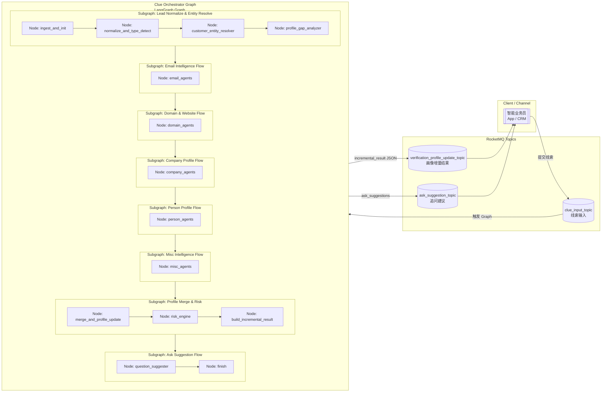

## LangGraph 编排
##### 🧠 体系结构分层概念表

| 概念           | 属于谁       | 粒度    | 职责            | 你系统里的角色                                 |
| ------------ | --------- | ----- | ------------- | --------------------------------------- |
| **Graph**    | LangGraph | 最顶层流程 | 控制整体编排        | Clue Orchestrator                       |
| **Subgraph** | LangGraph | 子流程   | 可复用流程组件       | Email / Domain / Company 等子流程           |
| **Node**     | LangGraph | 执行单元  | 1步逻辑          | 一个业务动作 / 调用一个或多个Agent                   |
| **Agent**    | 应用层       | 智能执行者 | 负责完成一个业务任务    | Email Intelligence / Company Registry 等 |
| **Tool**     | Model工具层  | 原子能力  | 提供事实查询 /调用API | DNS查询 / WHOIS / HTTP探测 等                |

---

### 📌 0 最顶层：Graph（工作流编排）

> 一个 Graph = 一条完整的业务流程

在你这里：

##### ✅ Graph 名称

```
Clue Orchestrator Workflow
```

##### 🎯 职责

* 作为**总流程控制器**
* 负责：

  * 决定什么时候触发哪个子流程
  * 收集各节点结果
  * 合并最终画像
  * 触发风控引擎
  * 写出 MQ

##### 🧩 对应你的图

```
 RocketMQ clue_input_topic
        ↓
   Clue Orchestrator Graph
        ↓
 RocketMQ profile_update / ask_hint
```

> Graph 只 orchestrate，不做业务逻辑计算。

---

### 📦 1 Subgraph（可选：复用型子流程）

> Subgraph 是 **Graph 内可拆分的子流程模块**

如果你愿意拆分（推荐），可以有：

##### Subgraph 列表

| Subgraph 名称                     | 作用           |
| ------------------------------- | ------------ |
| Lead Normalize & Entity Resolve | 线索标准化 + 客户归一 |
| Email Intelligence Subgraph     | email分析流程    |
| Domain Intelligence Subgraph    | 域名/官网流程      |
| Company Profile Subgraph        | 公司注册信息流程     |
| Person Profile Subgraph         | 人物信息流程       |
| Misc Intelligence Subgraph      | 电话、地区等       |
| Profile Merge & Risk            | 多源合并 + 风控    |
| Ask Suggestion Subgraph         | 追问建议生成       |

> Subgraph 内部再包含多个 node。

也可以先不拆分，直接 node 粒度即可。

---

### 🔹 2 Node（图中的基本执行步骤）

> Node = Graph 中的一个**执行步骤**

📌 每个 Node：

* 接收 state
* 处理
* 返回更新后的 state


#### 🟦 A 类：核心流程节点

| Node 名称                   | 对应图中模块 |
| ------------------------- | ------ |
| ingest_and_init           | 输入线索   |
| normalize_and_type_detect | C      |
| customer_entity_resolver  | D      |
| profile_gap_analyzer      | E      |


#### 🟩 B 类：业务能力节点（对应不同线索类型）

| Node           | 业务流      |
| -------------- | -------- |
| email_agents   | A1 A2 M1 |
| domain_agents  | B1 B2 M2 |
| company_agents | C1 C2 M3 |
| person_agents  | D1 M4    |
| misc_agents    | E1 M5    |

注意：

> 一个 Node 里可以包含多个 Agent
> 但 Node 本身**不做智能推理**


#### 🟨 C 类：汇总计算节点

| Node                     | 功能     |
| ------------------------ | ------ |
| merge_and_profile_update | 客户画像刷新 |
| risk_engine              | 风控计算   |
| build_incremental_result | 组装输出结果 |
| question_suggester       | 追问建议   |
| finish                   | 收尾     |

---

### 🤖 3 Agent（业务任务执行者）

> Agent = 负责完成一个“业务任务”的智能体或服务

📌 它可能是：

* LLM Prompt
* 内部API
* Pipeline

不属于 LangGraph 核心概念，但常配合使用。


##### Email 系列 Agent

| Agent 名称                    | 职责                    |
| --------------------------- | --------------------- |
| Email Intelligence Agent    | 识别邮箱类型 / 提取域名         |
| Domain Info Agent           | DNS / MX / WHOIS / 年龄 |
| Email Credibility Evaluator | 可信度打分                 |


##### Domain / 官网 Agent

| Agent 名称                  | 职责          |
| ------------------------- | ----------- |
| Website Probe Agent       | HTTP/SSL探测  |
| Web Crawl & Extract Agent | 内容抽取 / 联系方式 |
| Website Profile Merger    | 更新公司画像      |


##### 公司信息 Agent

| Agent 名称                   | 职责      |
| -------------------------- | ------- |
| Company Name Cleaner       | 规范化     |
| Business Registry Agent    | 查询工商    |
| Company Verification Agent | 法人/行业标注 |


##### Person Agent

| Agent 名称            | 职责           |
| ------------------- | ------------ |
| People Search Agent | LinkedIn/B2B |
| Role Detector       | 职位判定         |
| Fit Evaluator       | 行业匹配度        |


##### Misc Agent

| Agent 名称             | 职责      |
| -------------------- | ------- |
| Phone Region Agent   | 国家/号段识别 |
| Risk Country Checker | 黑名单判断   |


##### Risk Engine

| Agent 名称          | 职责       |
| ----------------- | -------- |
| Risk Model Engine | 计算最终风险评分 |


##### Dialogue Helper

| Agent 名称                  | 职责       |
| ------------------------- | -------- |
| Question Suggestion Agent | 给业务员追问建议 |

---

### 🔧 4 Tool（原子能力 / 事实查询）

> Tool = **面向 LLM 的函数 / API**

📌 由 Agent 调用
📌 不是 Graph 概念
📌 也不是 Node


##### Email Tool

| Tool               | 功能     |
| ------------------ | ------ |
| parse_email        | 提取域名   |
| validate_mx_record | 是否可达   |
| lookup_whois       | 注册商信息  |
| dns_query          | MX/A记录 |


##### Domain Tool

| Tool                | 功能      |
| ------------------- | ------- |
| http_probe          | 状态码/SSL |
| crawl_html          | 抓取网页    |
| extract_text        | 页面解析    |
| llm_extract_profile | 结构化公司信息 |


##### Company Registry Tool

| Tool                        | 功能   |
| --------------------------- | ---- |
| query_business_db           | 注册信息 |
| resolve_unified_social_code | 统一编码 |
| registry_risk_flags         | 经营状态 |


##### People Tool

| Tool                    | 功能     |
| ----------------------- | ------ |
| linkedin_search         | 个人资料   |
| company_employee_lookup | 验明是否在职 |


##### Phone Tool

| Tool             | 功能    |
| ---------------- | ----- |
| phone_geo_lookup | 国家/地区 |
| risk_country_db  | 风险国家库 |


##### Risk Tool

| Tool                    | 功能    |
| ----------------------- | ----- |
| score_entity_existence  | 存在性   |
| score_trade_reliability | 贸易可信度 |
| score_industry_fit      | 行业契合  |
| combine_final_score     | 综合评分  |

---

### 🧩 5 它们之间的关系（总表）

| 层级           | 谁调用谁               |
| ------------ | ------------------ |
| **Graph**    | 调用 subgraph / node |
| **Subgraph** | 调用 node            |
| **Node**     | 调用 agent           |
| **Agent**    | 调用 tool            |
| **Tool**     | 调用外部系统 / DB / API  |

---

### 🎯 6 设计原则总结

✔ Graph：
👉 只做「流程控制」

✔ Node：
👉 每一步业务逻辑边界清晰

✔ Agent：
👉 每类任务一个 Agent

✔ Tool：
👉 只提供事实能力
👉 不做推理

